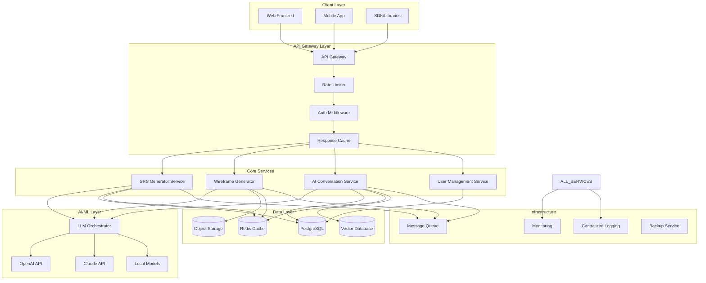
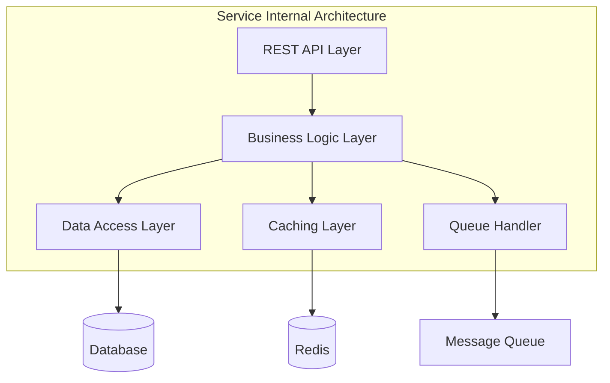
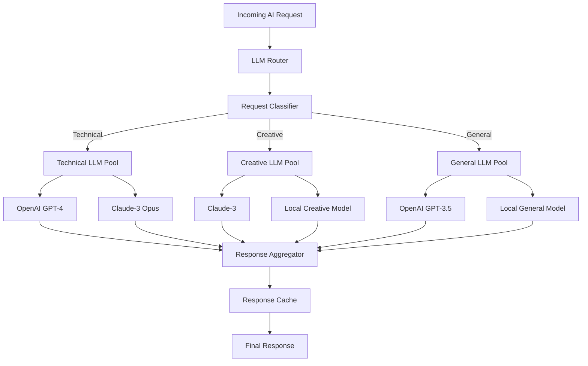
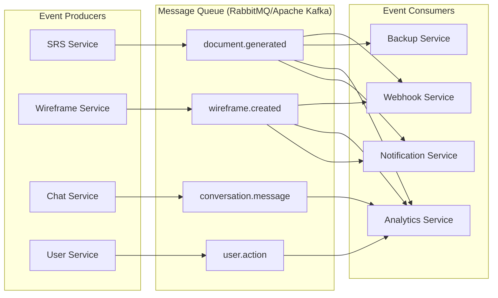
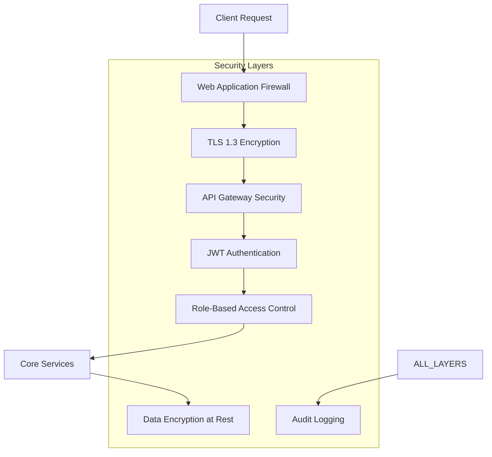
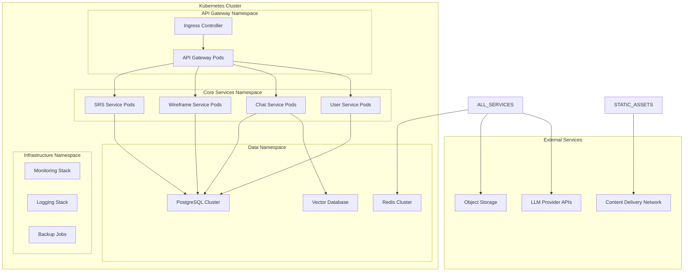
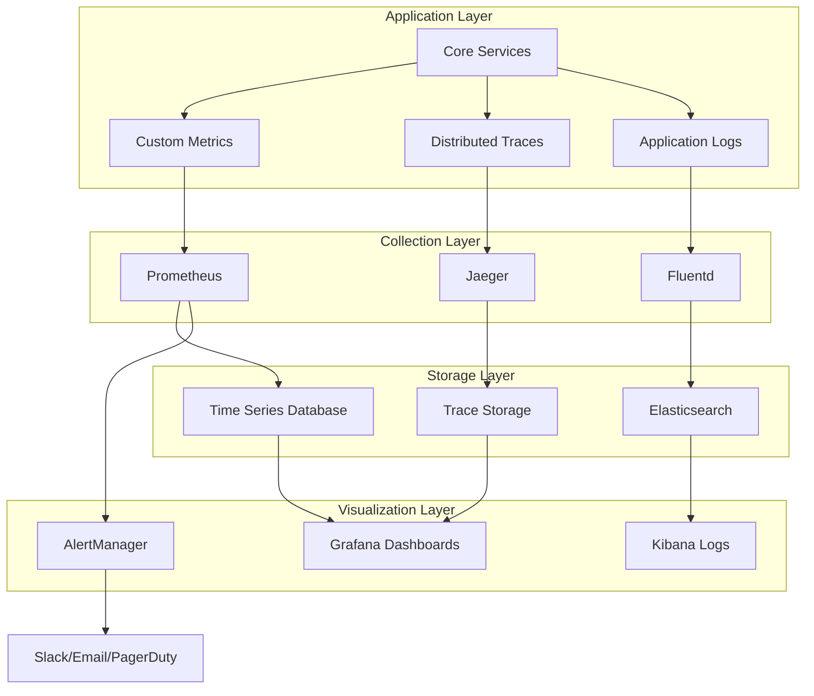
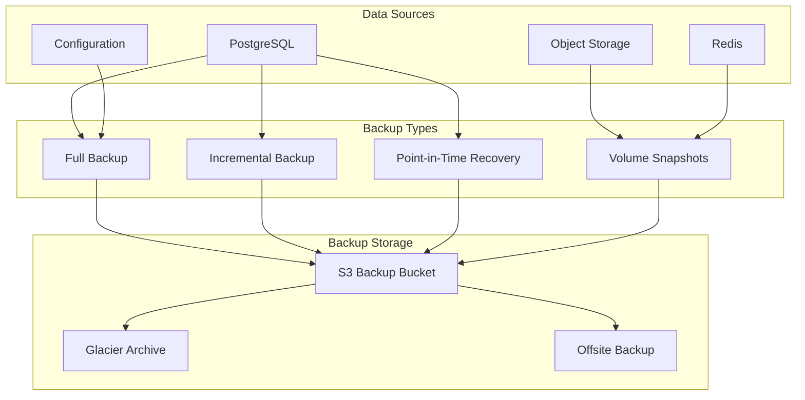
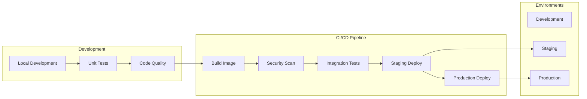

# System Architecture - BA Copilot AI Core Services

## Overview

The BA Copilot AI Core Services system is designed as a microservices-based architecture that provides AI-powered tools for Business Analysts. The system emphasizes scalability, maintainability, and high availability while delivering fast and reliable AI services.

## Architecture Principles

- **Microservices Architecture**: Loosely coupled, independently deployable services
- **API-First Design**: Well-defined REST APIs for all inter-service communication
- **Event-Driven Architecture**: Asynchronous processing for long-running operations
- **Cloud-Native**: Designed for containerized deployment and auto-scaling
- **Security by Design**: Zero-trust security model with comprehensive authentication
- **Observability**: Comprehensive logging, monitoring, and distributed tracing

## System Overview



## Core Components

### 1. API Gateway Layer

#### API Gateway

- **Technology**: Kong, AWS API Gateway, or Traefik
- **Responsibilities**:
  - Request routing and load balancing
  - SSL termination
  - API versioning
  - Request/response transformation
  - Cross-origin resource sharing (CORS)

#### Rate Limiter

- **Technology**: Redis-based rate limiting
- **Features**:
  - Per-user and per-endpoint limits
  - Sliding window algorithm
  - Burst capacity handling
  - Dynamic limit adjustment

#### Authentication Middleware

- **Technology**: JWT with RSA256 signing
- **Features**:
  - Token validation and refresh
  - Role-based access control (RBAC)
  - Session management
  - Multi-factor authentication support

### 2. Core Services Architecture

Each core service follows a consistent internal architecture:



#### SRS Generator Service

- **Technology**: FastAPI + Python
- **Components**:
  - Input validation and preprocessing
  - Template engine for SRS structure
  - LLM integration for content generation
  - Document versioning and storage
  - Export functionality (PDF, HTML, Markdown)

#### Wireframe Generator Service

- **Technology**: FastAPI + Python + Node.js (for HTML/CSS generation)
- **Components**:
  - Natural language processing for UI component extraction
  - Template-based wireframe generation
  - HTML/CSS code generation
  - Interactive preview system
  - Export to design tools (Figma, Sketch)

#### AI Conversation Service

- **Technology**: FastAPI + WebSocket + Python
- **Components**:
  - Real-time WebSocket connections
  - Conversation context management
  - Multi-LLM routing and fallback
  - Message history and search
  - Conversation analytics

#### User Management Service

- **Technology**: FastAPI + Python
- **Components**:
  - User authentication and authorization
  - Profile and preference management
  - Usage tracking and analytics
  - Subscription and billing integration

### 3. AI/ML Layer

#### LLM Orchestrator



**Features**:

- Intelligent routing based on request type
- Load balancing across multiple providers
- Fallback mechanisms for high availability
- Response caching for performance
- Cost optimization through provider selection

### 4. Data Layer Architecture

#### Primary Database (PostgreSQL)

```sql
-- Core entities schema
Users
├── user_id (UUID, PK)
├── email (VARCHAR, UNIQUE)
├── password_hash (VARCHAR)
├── full_name (VARCHAR)
├── created_at (TIMESTAMP)
└── preferences (JSONB)

Documents (SRS)
├── document_id (UUID, PK)
├── user_id (UUID, FK)
├── project_name (VARCHAR)
├── content (TEXT)
├── metadata (JSONB)
├── created_at (TIMESTAMP)
└── updated_at (TIMESTAMP)

Wireframes
├── wireframe_id (UUID, PK)
├── user_id (UUID, FK)
├── html_content (TEXT)
├── css_styles (TEXT)
├── metadata (JSONB)
├── created_at (TIMESTAMP)
└── updated_at (TIMESTAMP)

Conversations
├── conversation_id (UUID, PK)
├── user_id (UUID, FK)
├── title (VARCHAR)
├── created_at (TIMESTAMP)
└── updated_at (TIMESTAMP)

Messages
├── message_id (UUID, PK)
├── conversation_id (UUID, FK)
├── role (ENUM: user, assistant)
├── content (TEXT)
├── metadata (JSONB)
└── timestamp (TIMESTAMP)
```

#### Caching Layer (Redis)

- **Session Storage**: User sessions and JWT tokens
- **API Response Cache**: Frequently accessed data
- **Rate Limiting**: Request counters and windows
- **Real-time Data**: WebSocket connection states
- **Queue Management**: Job queues for async processing

#### Object Storage (S3/MinIO)

- **Document Storage**: Generated PDFs, exports
- **Wireframe Assets**: HTML files, CSS, images
- **User Uploads**: Input documents and attachments
- **Backup Storage**: Database backups and archives

#### Vector Database (Pinecone/Weaviate)

- **Conversation Embeddings**: For semantic search
- **Document Similarity**: Template matching
- **User Behavior Vectors**: Recommendation system
- **Knowledge Base**: FAQ and help content

### 5. Message Queue and Event System



### 6. Security Architecture



**Security Features**:

- End-to-end encryption (TLS 1.3)
- JWT tokens with short expiration
- Role-based access control
- API rate limiting and DDoS protection
- Data encryption at rest (AES-256)
- Comprehensive audit logging
- Regular security scanning and updates

### 7. Deployment Architecture

#### Container Architecture



#### Infrastructure Components

- **Container Orchestration**: Kubernetes
- **Service Mesh**: Istio (optional, for advanced traffic management)
- **Load Balancer**: NGINX Ingress Controller
- **Auto Scaling**: Horizontal Pod Autoscaler (HPA)
- **Persistent Storage**: Kubernetes Persistent Volumes
- **Secret Management**: Kubernetes Secrets + External Secret Operator

### 8. Monitoring and Observability



**Key Metrics**:

- API response times and error rates
- LLM service latency and costs
- Database connection pools and query performance
- Cache hit rates and memory usage
- User activity and feature adoption
- Infrastructure resource utilization

### 9. Disaster Recovery and Backup

#### Backup Strategy



**Recovery Time Objectives (RTO)**:

- Critical Services: < 15 minutes
- Database Recovery: < 30 minutes
- Full System Recovery: < 2 hours

**Recovery Point Objectives (RPO)**:

- Transactional Data: < 5 minutes
- User-generated Content: < 15 minutes
- Configuration Changes: < 1 hour

### 10. Performance and Scalability

#### Horizontal Scaling Strategy

- **Auto-scaling**: Based on CPU, memory, and custom metrics
- **Load Distribution**: Round-robin with health checks
- **Database Scaling**: Read replicas and connection pooling
- **Cache Scaling**: Redis Cluster with consistent hashing
- **CDN Integration**: Static asset distribution

#### Performance Targets

- API Response Time: P95 < 200ms, P99 < 500ms
- AI Service Response: P95 < 3s, P99 < 10s
- Database Query Time: P95 < 50ms
- Cache Hit Rate: > 80%
- System Availability: 99.9% uptime

### 11. Development and Deployment Pipeline



**Pipeline Features**:

- Automated testing and quality gates
- Container security scanning
- Blue-green deployment strategy
- Automated rollback on failure
- Feature flags for gradual rollouts

## Technology Stack Summary

| Component              | Technology            | Purpose                               |
| ---------------------- | --------------------- | ------------------------------------- |
| **API Framework**      | FastAPI               | High-performance Python web framework |
| **Database**           | PostgreSQL 14+        | Primary data storage                  |
| **Cache**              | Redis 6+              | Session storage and caching           |
| **Message Queue**      | RabbitMQ/Apache Kafka | Asynchronous processing               |
| **Object Storage**     | MinIO/AWS S3          | File and document storage             |
| **Vector Database**    | Pinecone/Weaviate     | Semantic search and embeddings        |
| **Container Platform** | Docker + Kubernetes   | Container orchestration               |
| **API Gateway**        | Kong/Traefik          | API routing and management            |
| **Monitoring**         | Prometheus + Grafana  | Metrics and visualization             |
| **Logging**            | ELK Stack             | Centralized logging                   |
| **Tracing**            | Jaeger                | Distributed tracing                   |
| **Security**           | JWT + OAuth2          | Authentication and authorization      |
| **CI/CD**              | GitHub Actions        | Automated deployment pipeline         |

## Future Enhancements

1. **Machine Learning Pipeline**: Custom model training and deployment
2. **GraphQL API**: Alternative API interface for complex queries
3. **Multi-tenant Architecture**: Support for enterprise customers
4. **Advanced Analytics**: Business intelligence and reporting
5. **Mobile SDK**: Native mobile application support
6. **Plugin System**: Third-party integrations and extensions
7. **Advanced AI Features**: Code generation, automated testing
8. **Compliance Framework**: SOC2, GDPR, HIPAA compliance modules

This architecture provides a solid foundation for the BA Copilot AI Core Services, ensuring scalability, reliability, and maintainability while delivering high-performance AI-powered tools for Business Analysts.
