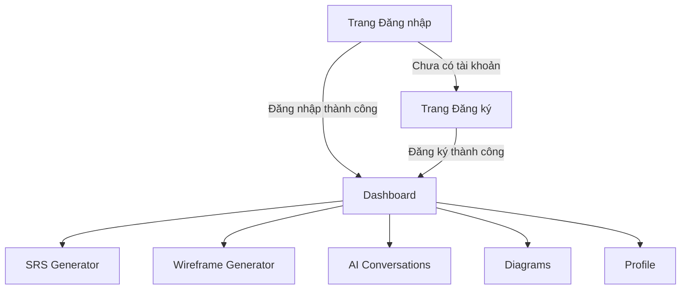

# Phác Thảo Luồng Ứng Dụng và Thiết Kế Giao Diện (UI/UX)

## 1. Mục Lục

- Giới thiệu tổng quan
- Danh sách trang (Pages)
- Luồng điều hướng (User Flow)
- Thiết kế UI/UX cho từng trang
  - Trang Đăng nhập / Đăng ký
  - Trang Dashboard chính
  - Trang Tạo SRS
  - Trang Tạo Wireframe
  - Trang Quản lý hội thoại AI
  - Trang Diagrams (Tuỳ chọn)

## 2. Giới thiệu tổng quan
Ứng dụng hỗ trợ BA tự động sinh tài liệu SRS, wireframes, quản lý hội thoại AI và tạo diagrams. Ứng dụng sử dụng NextJS, TailwindCSS cho frontend, FastAPI và PostgreSQL cho backend, Docker, CI/CD với GitHub Actions.

## 3. Danh sách trang (Pages)

1. **Auth**
   - Login
   - Register
2. **Dashboard**
3. **SRS Generator**
4. **Wireframe Generator**
5. **AI Conversations**
6. **Diagrams** (Tùy chọn)
7. **User Profile / Settings**

## 4. Luồng điều hướng (User Flow)

## 5. Thiết kế UI/UX cho từng trang

### 5.1 Trang Đăng nhập / Đăng ký

- **Header:** Logo ứng dụng + tiêu đề "Đăng nhập" hoặc "Đăng ký".
- **Form:**
  - Email (input text)
  - Password (input password)
  - Buttons: Đăng nhập / Đăng ký, Chuyển sang trang đối ứng
- **Footer:** Link Chính sách bảo mật, Điều khoản.

### 5.2 Trang Dashboard chính

- **Sidebar:**
  - Dashboard Overview
  - SRS Generator
  - Wireframe Generator
  - AI Conversations
  - Diagrams
  - Settings
- **Main Content:** Hiển thị tổng quan, recent projects, quick action buttons.

### 5.3 Trang Tạo SRS

- **Breadcrumb:** Dashboard > SRS Generator
- **Form nhập:**
  - Tên dự án
  - Mô tả tổng quan
  - Các mục tính năng (epics) (list)
  - Buttons: Sinh SRS, Clear
- **Kết quả:**
  - Hiển thị nội dung SRS theo template, có thể chỉnh sửa inline, Export PDF/MD.

### 5.4 Trang Tạo Wireframe

- **Breadcrumb:** Dashboard > Wireframe Generator
- **Form nhập:**
  - Mô tả page (text area)
  - Chọn theme/template wireframe
  - Buttons: Sinh wireframe, Clear
- **Kết quả:**
  - Canvas hiển thị wireframe cơ bản (HTML/CSS), có thể kéo thả, chỉnh sửa.

### 5.5 Trang Quản lý hội thoại AI

- **Breadcrumb:** Dashboard > AI Conversations
- **Sidebar Conversations list**
- **Main Chat Window:** hiển thị tin nhắn, input text, send
- **Toolbar:** nút Xóa, Xuất transcript

### 5.6 Trang Diagrams (Tùy chọn)

- **Breadcrumb:** Dashboard > Diagrams
- **Chọn loại diagram:** dropdown (Sequence, Use Case, Class...)
- **Form mô tả:** text area
- **Buttons:** Sinh Diagram, Clear
- **Kết quả:** hiển thị diagram SVG, có thể export.

## 6. Kết luận
Tài liệu phác thảo luồng và UI/UX liền mạch, chi tiết cho từng trang, đảm bảo trải nghiệm nhất quán và rõ ràng.