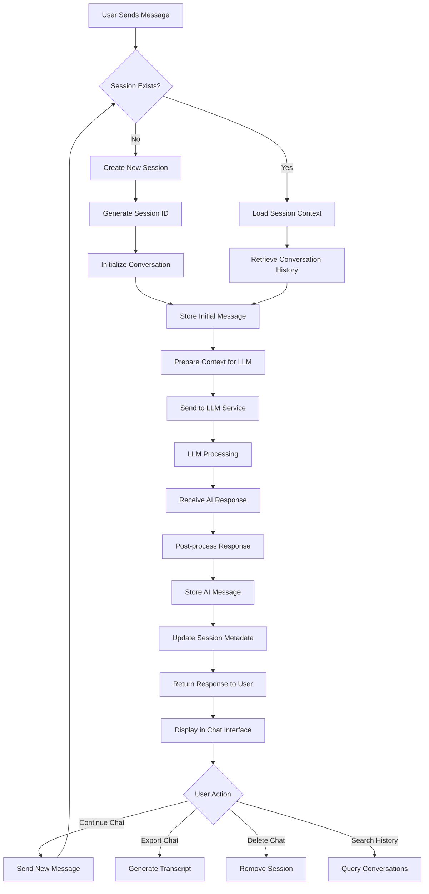
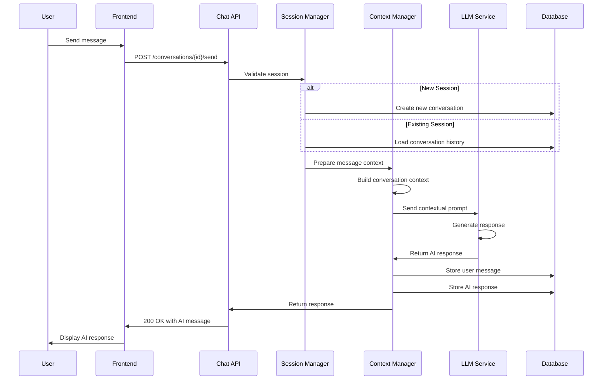
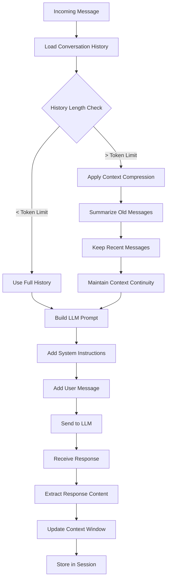
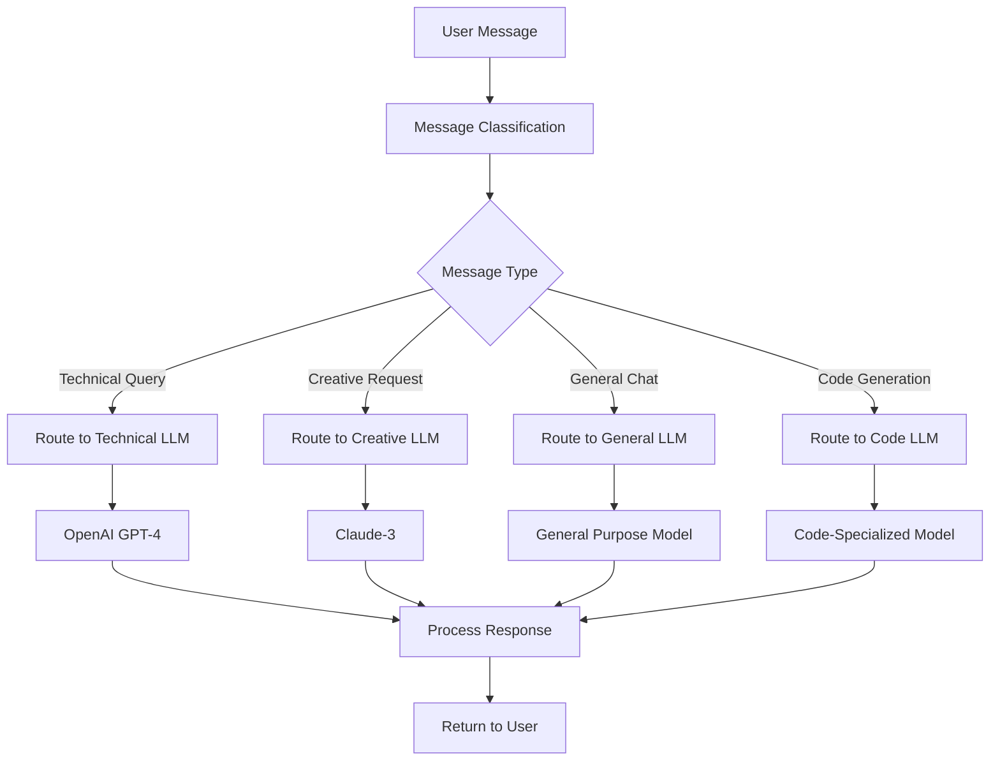
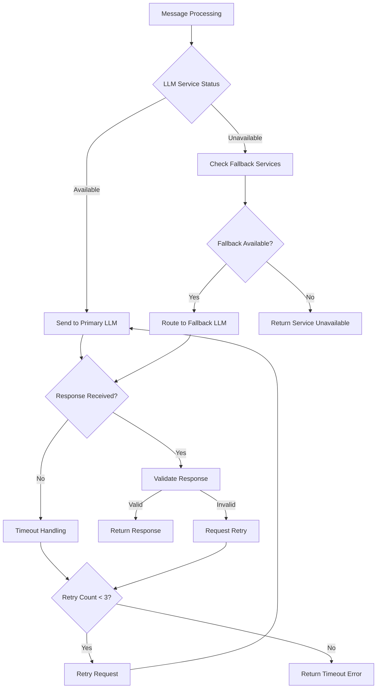
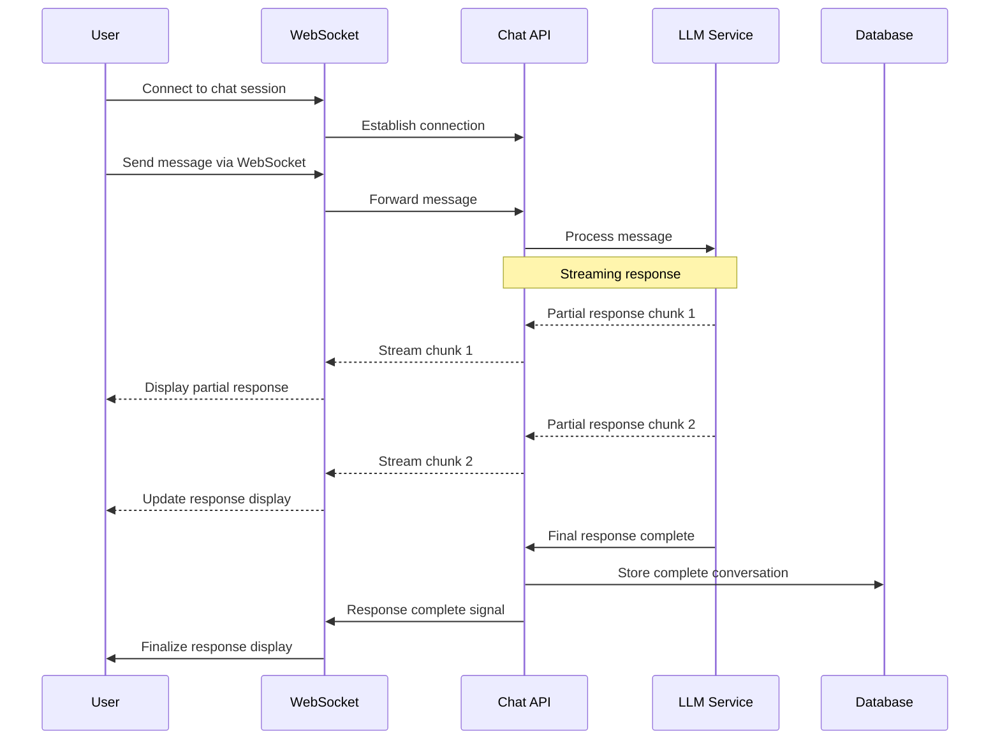

# AI Conversation Manager Service Flow Diagram

## Overview

The AI Conversation Manager handles chat interactions between users and AI, maintaining conversation history and providing contextual responses.

## Primary Flow Diagram

## Session Management Architecture

## Context Management Flow

## Multi-LLM Routing Flow

## Error Handling and Fallback

## Real-time Communication Flow

