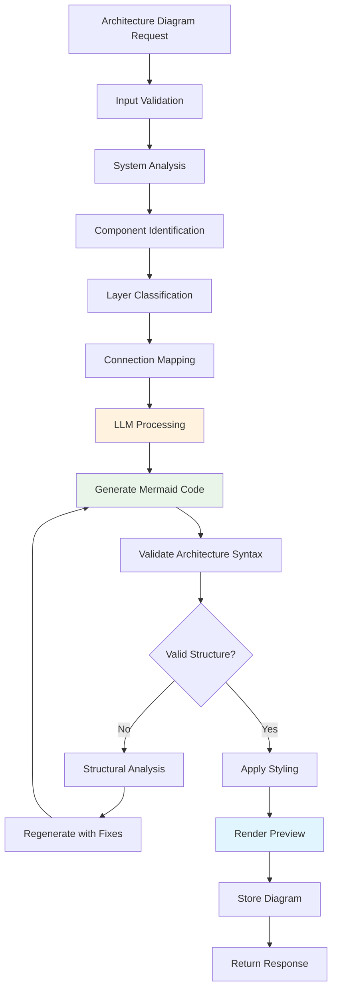
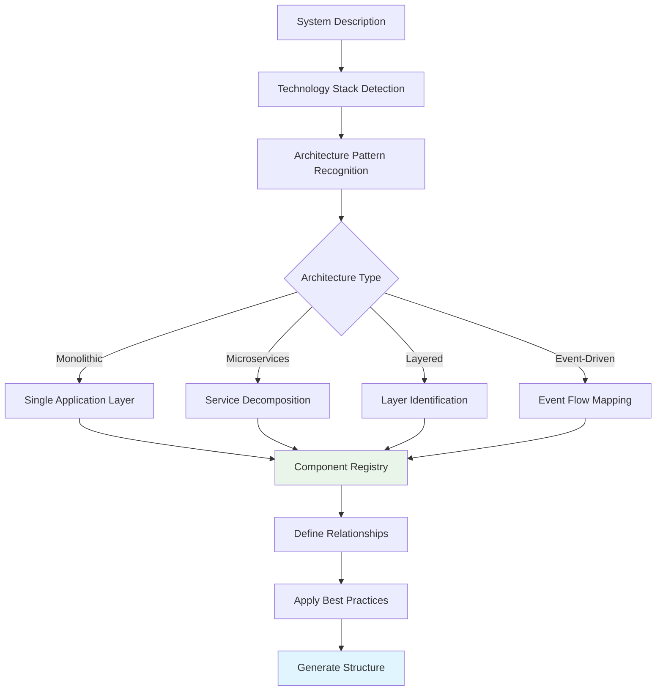
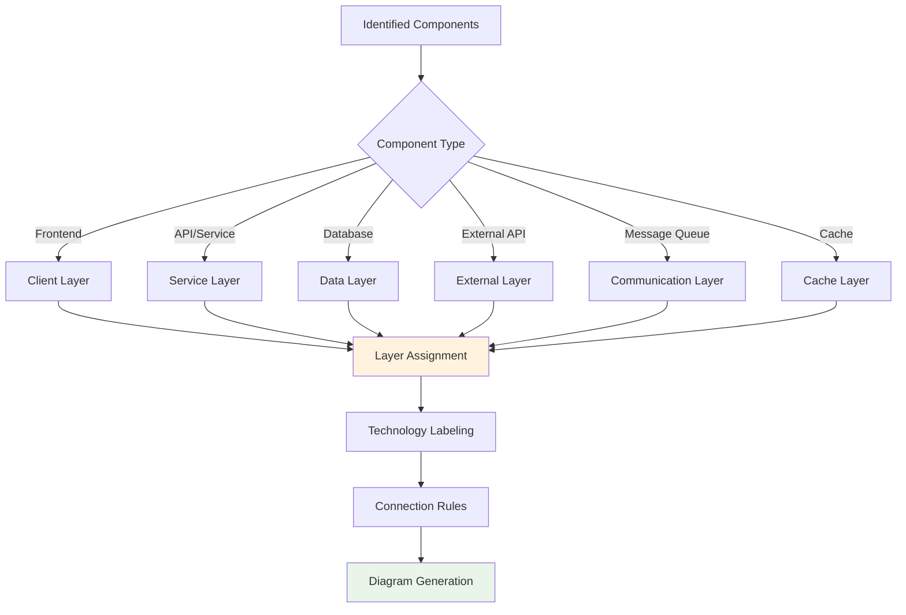
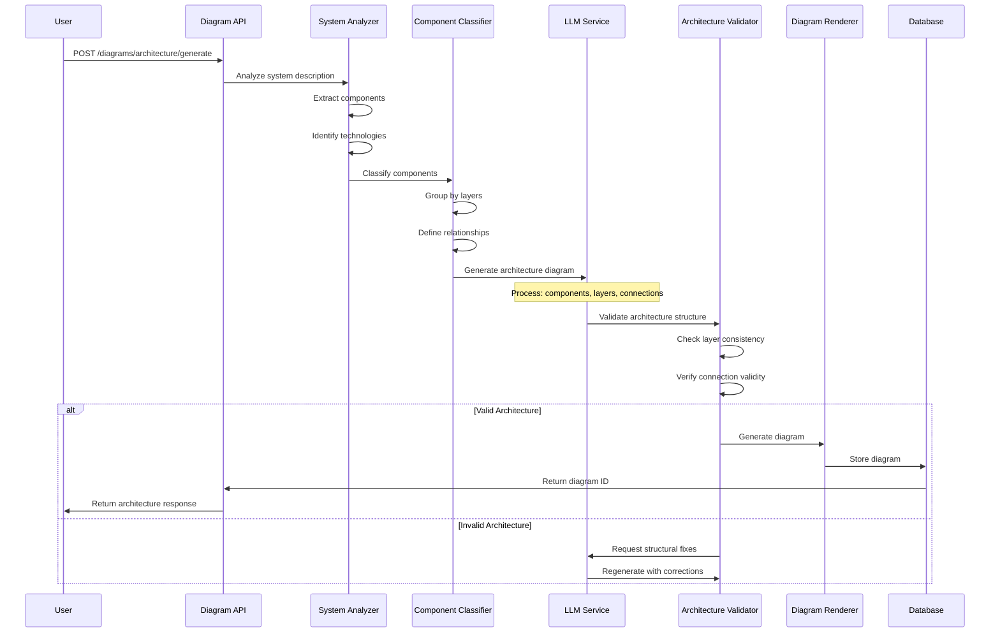
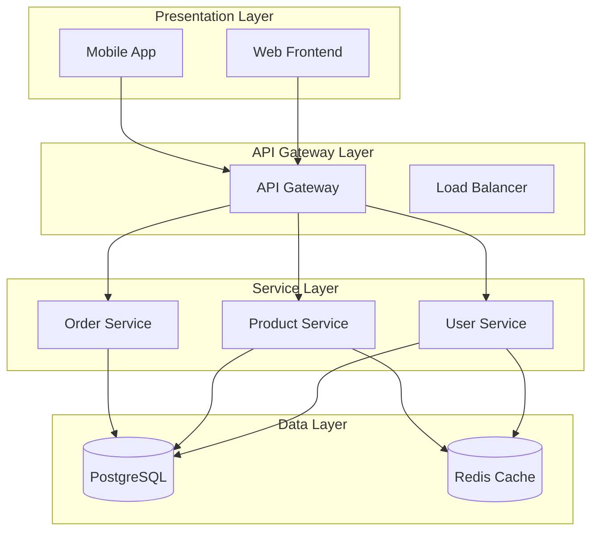
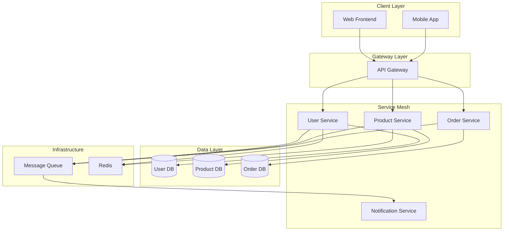
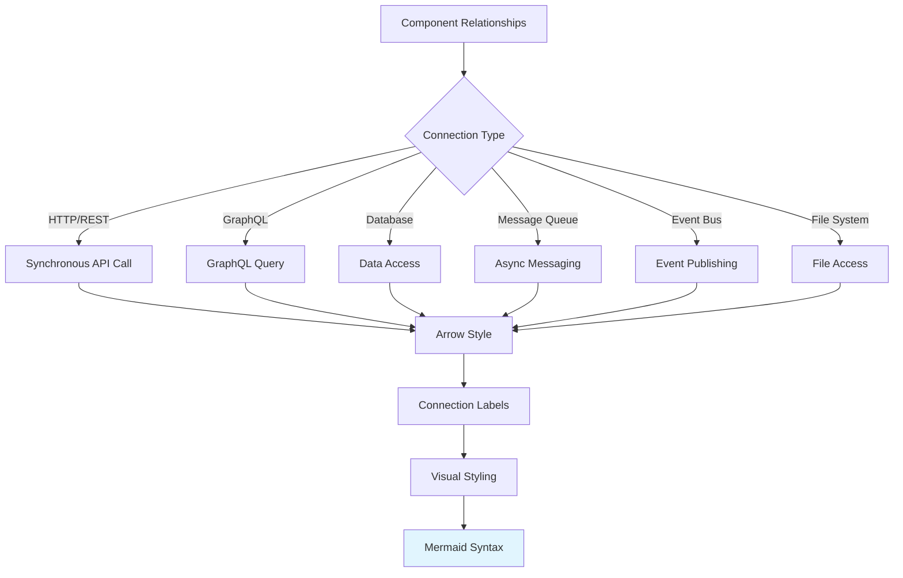
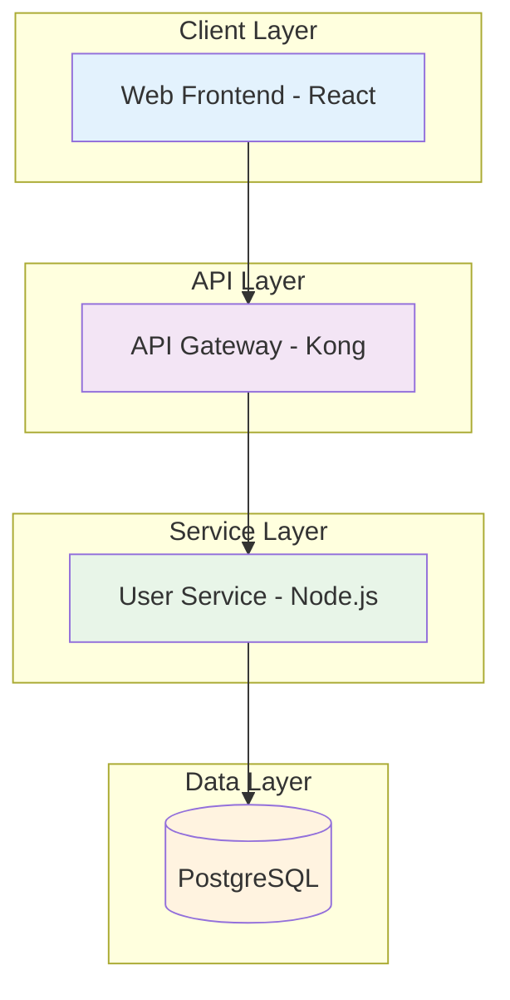
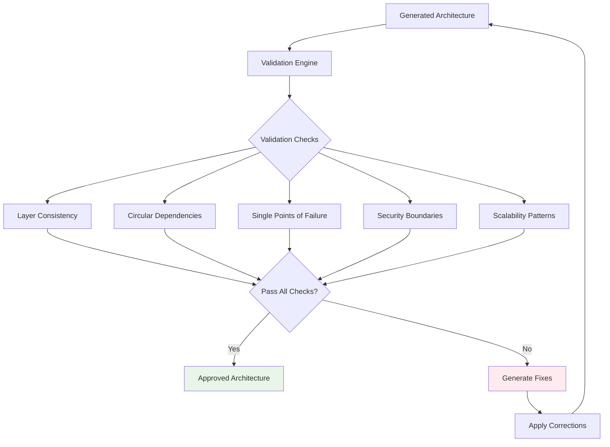
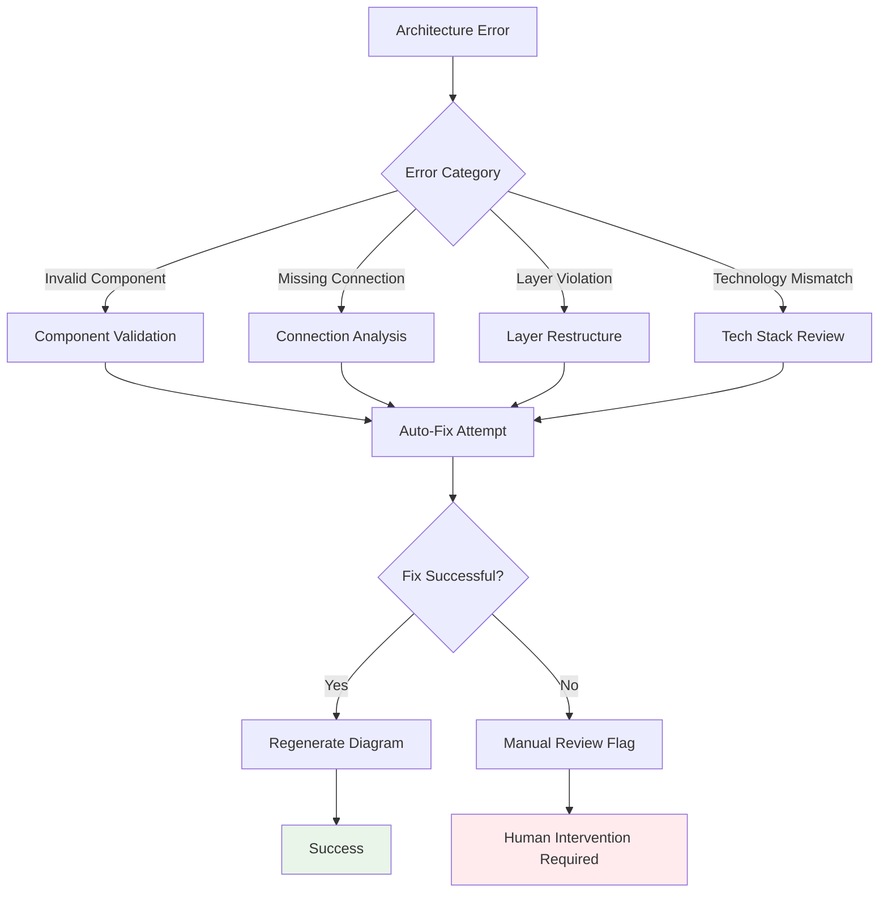

# Architecture Diagram Generation Workflow

## Overview

The Architecture Diagram Generator creates system architecture diagrams from high-level descriptions, component specifications, or extracted requirements. This service focuses on visualizing system structure, component relationships, and data flow patterns.

## Core Workflow



## System Analysis Process



## Component Classification



## Detailed Processing Flow



## Layer Organization Patterns

### Layered Architecture



### Microservices Architecture



## Connection Type Recognition



## Sample Input/Output

### Input Example

```json
{
  "title": "E-commerce System Architecture",
  "description": "Scalable e-commerce platform with microservices",
  "components": [
    {
      "name": "Web Frontend",
      "type": "client",
      "technology": "React"
    },
    {
      "name": "API Gateway",
      "type": "service",
      "technology": "Kong"
    },
    {
      "name": "User Service",
      "type": "service",
      "technology": "Node.js"
    },
    {
      "name": "PostgreSQL",
      "type": "database",
      "technology": "PostgreSQL"
    }
  ],
  "connections": [
    {
      "from": "Web Frontend",
      "to": "API Gateway",
      "type": "http"
    }
  ]
}
```

### Generated Mermaid Output



## Architecture Validation Rules



## Error Handling



## Integration Points

### With SRS Generator

Architecture diagrams are automatically generated for:

- System overview sections
- Technical architecture descriptions
- Component interaction patterns
- Deployment architecture

### With AI Conversation

Users can request architecture diagrams through natural language:

- "Show me the system architecture for a microservices platform"
- "Generate an architecture diagram for a 3-tier web application"
- "Create a diagram showing our current tech stack"

## Performance Considerations

- **Complexity Limits**: Maximum 50 components per diagram
- **Layer Limits**: Maximum 10 architectural layers
- **Processing Time**: 15-45 seconds depending on complexity
- **Caching**: Architecture patterns cached for reuse

## Quality Metrics

- **Component Recognition**: 92% accuracy for standard architectures
- **Layer Classification**: 88% accuracy for complex systems
- **Connection Mapping**: 85% accuracy for implicit relationships
- **Architecture Compliance**: 94% adherence to best practices
