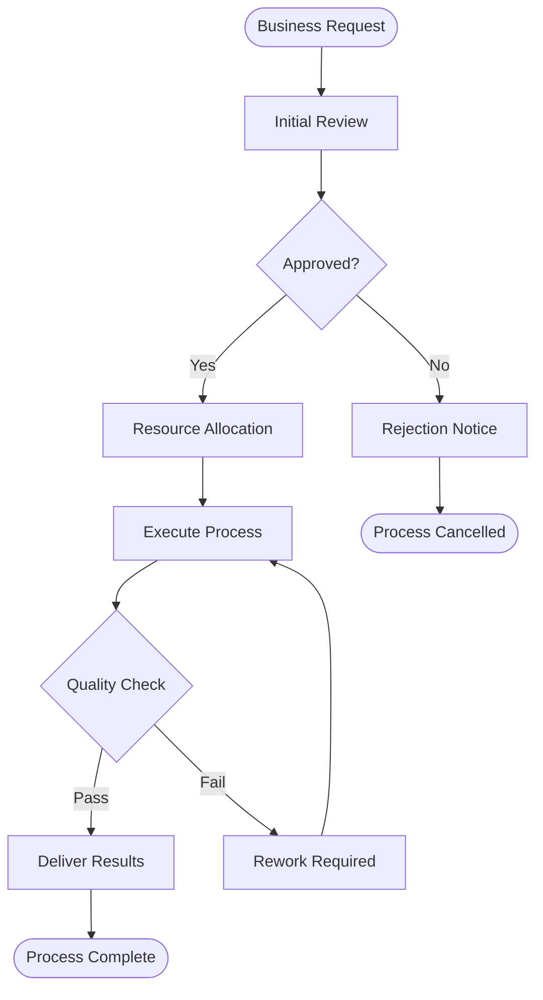

# Flowchart Generation Workflow

## Overview

The Flowchart Generator creates process flowcharts and workflow diagrams from natural language descriptions, business process requirements, or procedural documents. This service focuses on visualizing step-by-step processes, decision points, and process flows.

## Core Workflow


## Process Step Classification


## Decision Logic Processing


## Flow Path Construction


## Detailed Processing Flow


## Flowchart Node Types

### Standard Process Nodes


### Complex Flow Patterns


## Sample Input/Output

### Input Example

```json
{
  "title": "Order Processing Workflow",
  "description": "Process customer orders from placement to delivery",
  "process_steps": [
    {
      "id": "start",
      "type": "start",
      "label": "Order Placed"
    },
    {
      "id": "validate",
      "type": "process",
      "label": "Validate Order"
    },
    {
      "id": "payment_check",
      "type": "decision",
      "label": "Payment Valid?"
    },
    {
      "id": "process_order",
      "type": "process",
      "label": "Process Order"
    },
    {
      "id": "end_success",
      "type": "end",
      "label": "Order Complete"
    }
  ],
  "connections": [
    {
      "from": "start",
      "to": "validate"
    },
    {
      "from": "payment_check",
      "to": "process_order",
      "condition": "Yes"
    }
  ]
}
```

### Generated Mermaid Output


## Flow Validation Rules


## Error Handling


## Domain-Specific Templates

### Business Process Template



### Technical Workflow Template


## Performance Optimization


## Integration Points

### With SRS Generator

Flowcharts are automatically generated for:

- Business process descriptions
- System workflow requirements
- User journey specifications
- Technical process flows

### With AI Conversation

Users can request flowcharts through natural language:

- "Create a flowchart for the user registration process"
- "Show me the workflow for handling customer complaints"
- "Generate a process diagram for our approval workflow"

## Performance Considerations

- **Node Limits**: Maximum 100 nodes per flowchart
- **Decision Points**: Maximum 25 decision points per flow
- **Processing Time**: 15-60 seconds based on complexity
- **Caching**: Common process patterns cached for reuse

## Quality Metrics

- **Step Identification**: 89% accuracy for structured processes
- **Decision Logic**: 85% accuracy for conditional flows
- **Flow Continuity**: 93% for complete flow validation
- **Process Completeness**: 87% coverage of described processes
