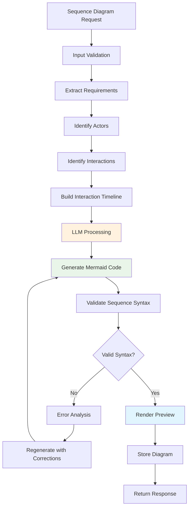
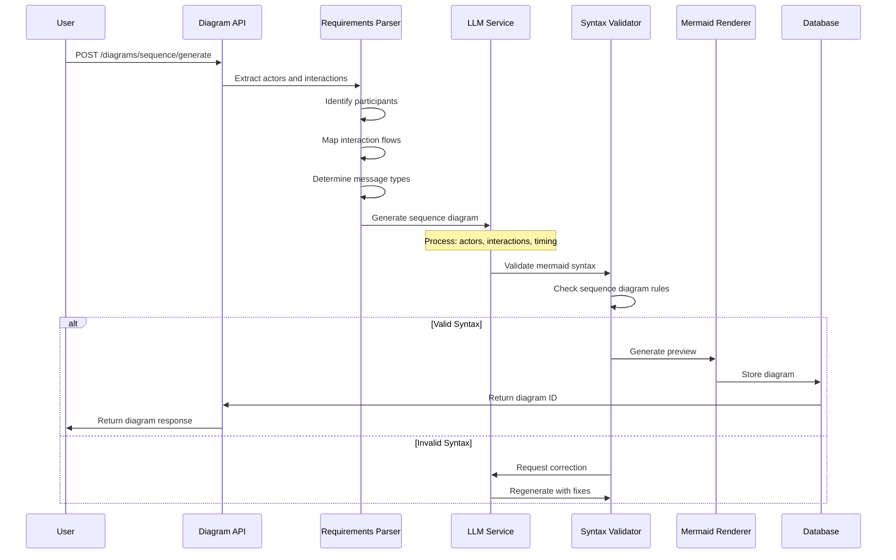
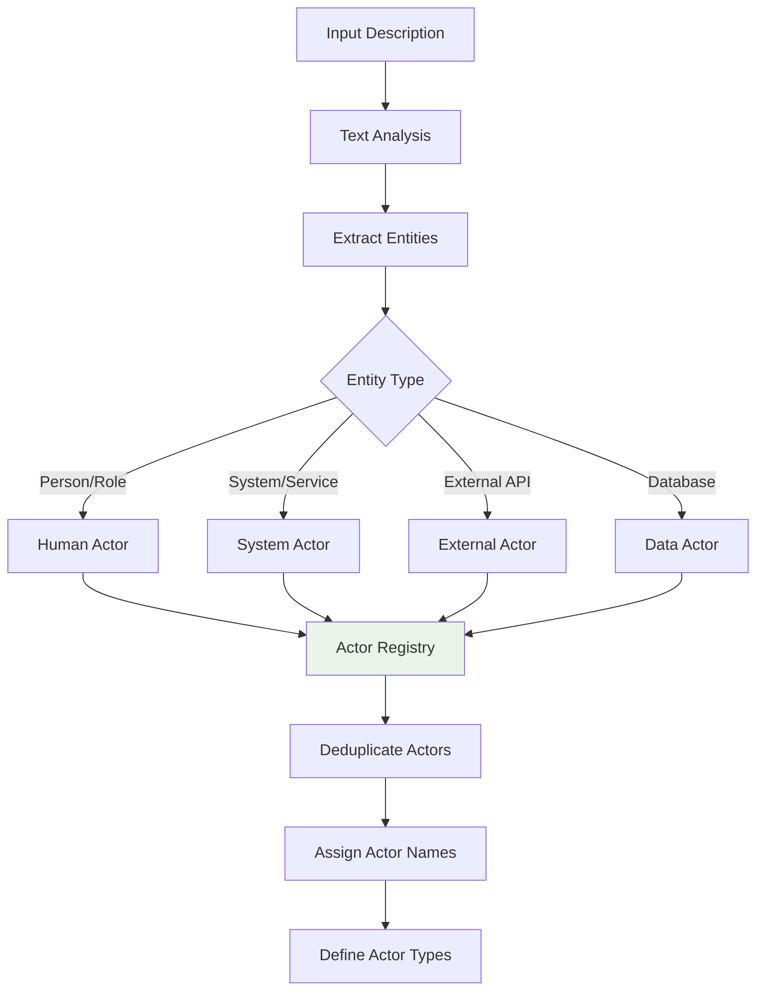
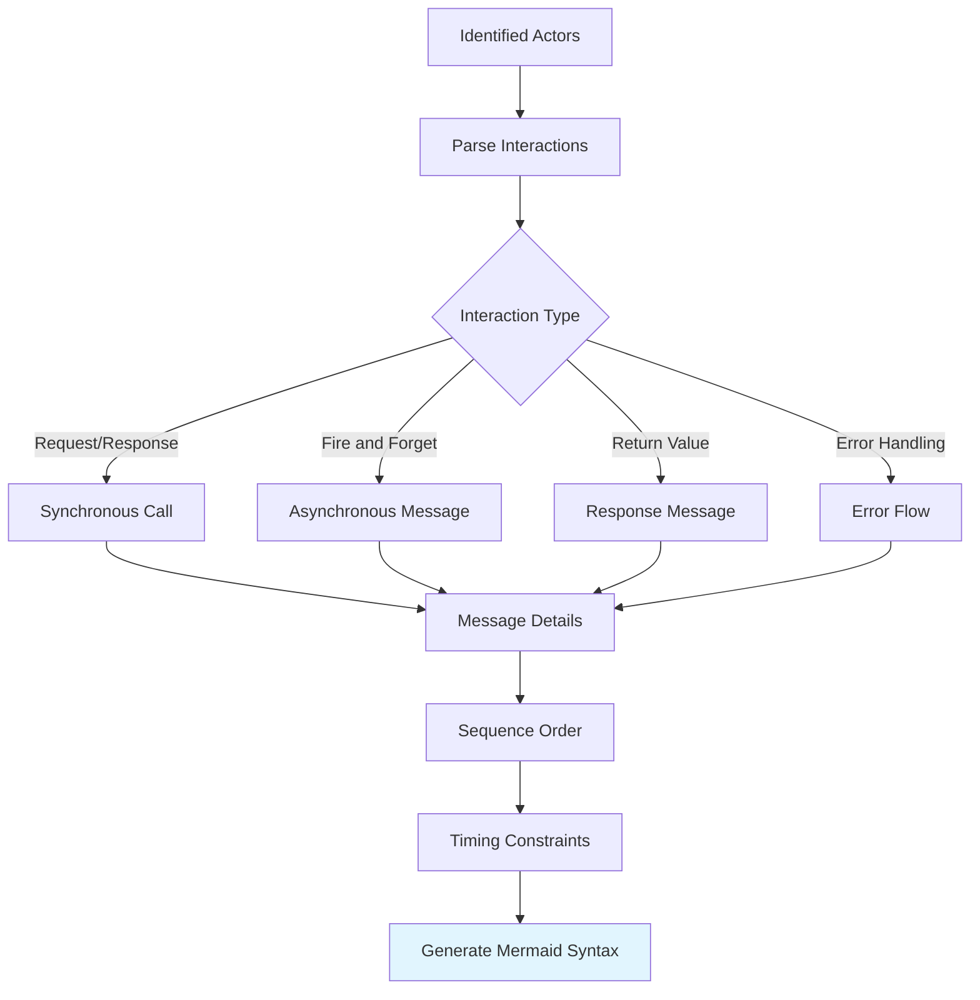
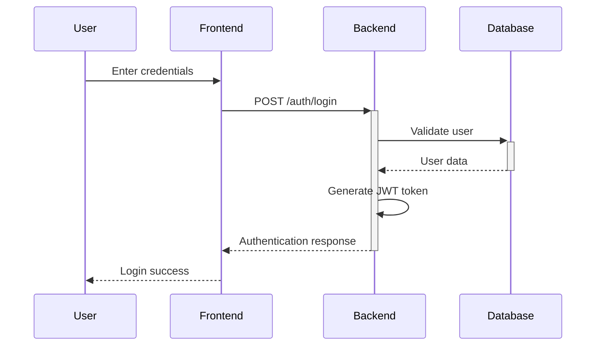
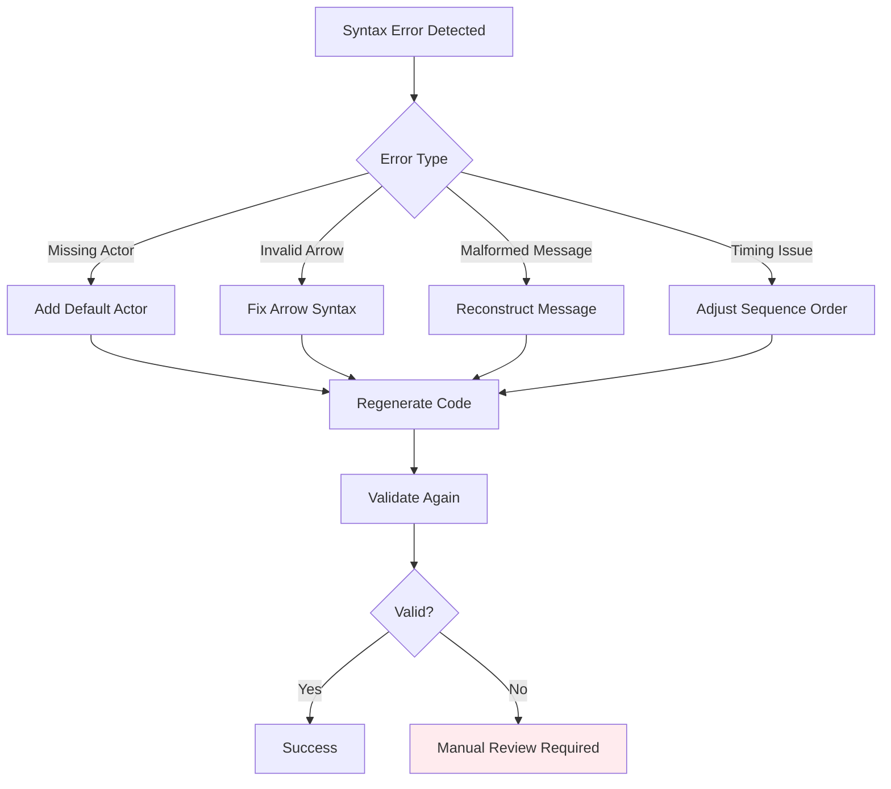

# Sequence Diagram Generation Workflow

## Overview

The Sequence Diagram Generator creates UML sequence diagrams from natural language descriptions or extracted requirements. This service focuses on modeling interactions between different actors, systems, or components over time.

## Core Workflow



## Detailed Processing Flow



## Actor Identification Process



## Interaction Mapping



## Sample Input/Output

### Input Example

```json
{
  "title": "User Authentication Flow",
  "description": "User logs in, system validates credentials, generates JWT token",
  "actors": ["User", "Frontend", "Backend", "Database"],
  "interactions": [
    {
      "from": "User",
      "to": "Frontend",
      "action": "Enter credentials",
      "type": "sync"
    },
    {
      "from": "Frontend",
      "to": "Backend",
      "action": "POST /auth/login",
      "type": "async"
    }
  ]
}
```

### Generated Mermaid Output



## Error Handling



## Integration Points

### With SRS Generator

When generating SRS documents with diagrams enabled, sequence diagrams are automatically created for:

- User authentication flows
- API interaction patterns
- Data processing workflows
- Error handling scenarios

### With AI Conversation

Users can request sequence diagrams through natural language:

- "Generate a sequence diagram for user registration"
- "Show me the payment processing flow"
- "Create a diagram for the data synchronization process"

## Performance Considerations

- **Caching**: Generated diagrams are cached for 24 hours
- **Rate Limiting**: 10 sequence diagrams per minute per user
- **Complexity Limits**: Maximum 20 actors, 50 interactions per diagram
- **Timeout**: 30 seconds maximum generation time

## Quality Metrics

- **Syntax Validation**: 99.5% first-pass success rate
- **Actor Recognition**: 95% accuracy for standard business domains
- **Interaction Mapping**: 90% accuracy for complex flows
- **User Satisfaction**: Based on diagram usefulness ratings
