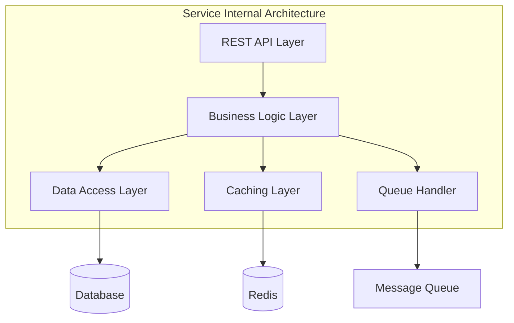
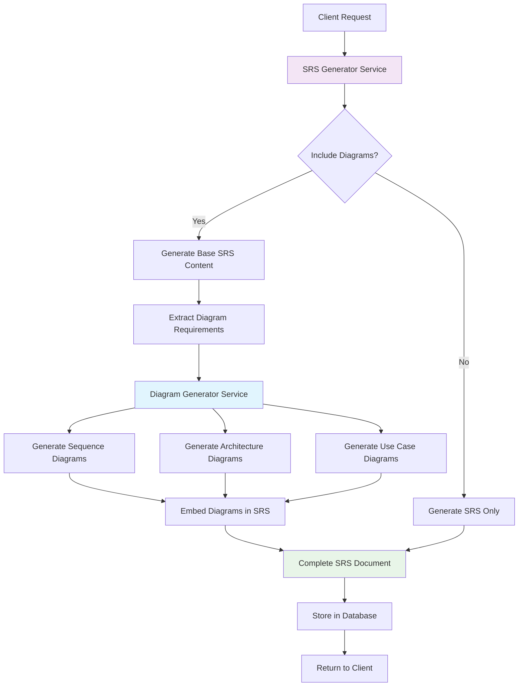
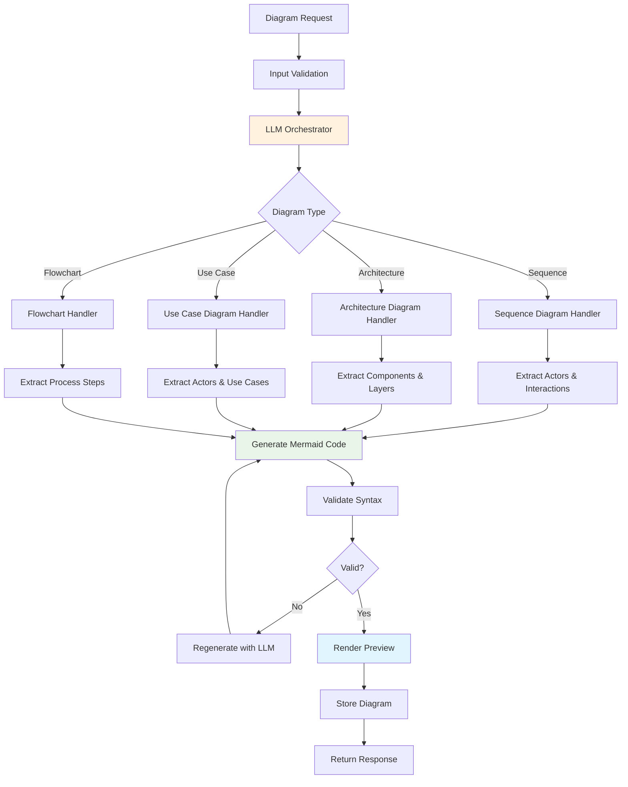
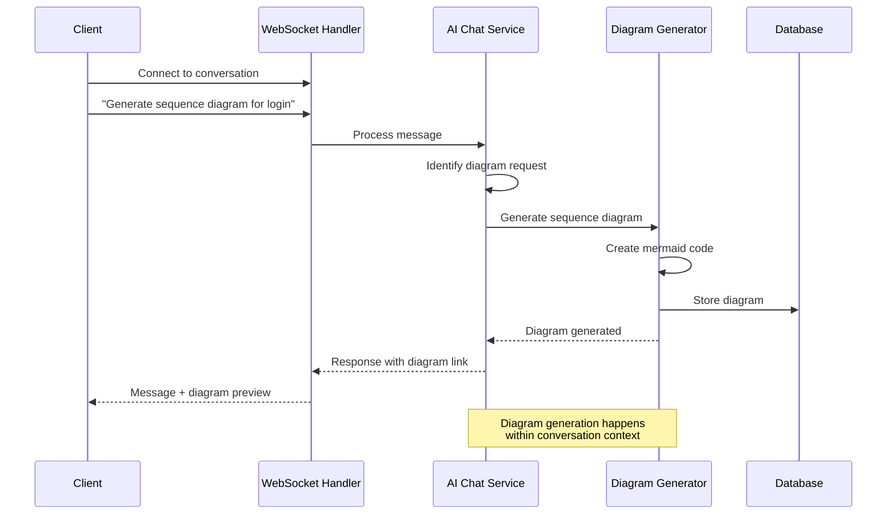
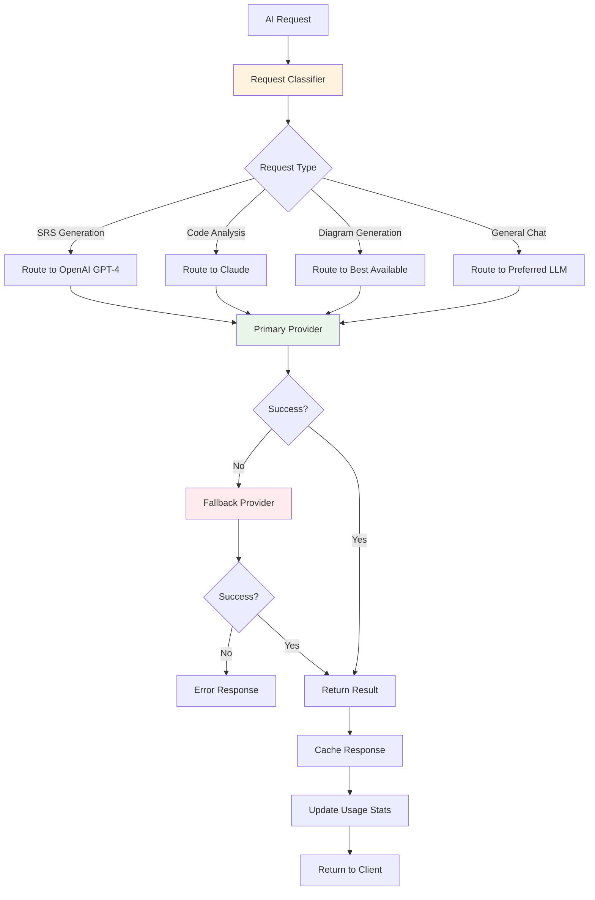
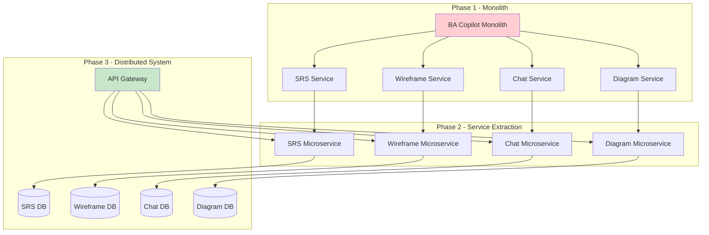
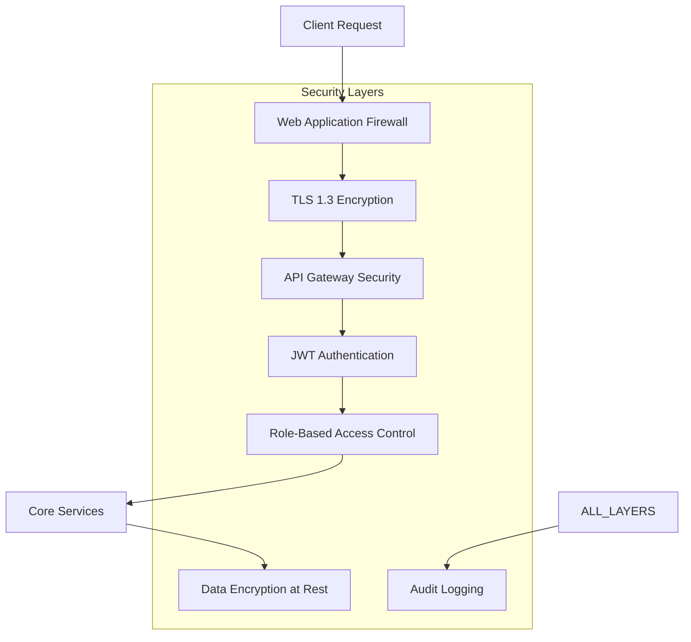

# System Architecture - BA Copilot AI Services

## Overview

The BA Copilot AI Services system is designed as a **modular monolith** that provides AI-powered tools for Business Analysts. This repository specifically handles AI-powered document and diagram generation services, while relying on the Backend Repository for user management and core business logic.

## Architecture Principles

- **AI Services Focus**: Specialized in AI-powered content generation (SRS, wireframes, diagrams, conversations)
- **Backend Integration**: Relies on Backend Repository for user authentication and management
- **Modular Monolith**: Well-defined service boundaries within a single deployment unit
- **API-First Design**: Clear internal interfaces that can become external APIs later
- **Domain-Driven Design**: Services organized around AI generation domains
- **Progressive Enhancement**: Start simple, scale complexity as needed
- **Migration-Ready**: Architecture supports future microservices extraction

## System Overview

The system is designed as an **AI-focused modular monolith** that integrates with the Backend Repository:

### Current Architecture (AI Services Only)

```
┌─────────────────┐    ┌──────────────────┐    ┌─────────────────┐
│   Web Frontend  │    │   Mobile App     │    │  SDK/Libraries  │
└─────────────────┘    └──────────────────┘    └─────────────────┘
          │                       │                       │
          └───────────────────────┼───────────────────────┘
                                  │
                    ┌─────────────▼─────────────┐
                    │    Backend Repository    │
                    │  (User Management &      │
                    │   Core Business Logic)   │
                    └─────────────┬─────────────┘
                                  │ JWT + user_id
                    ┌─────────────▼─────────────┐
                    │   AI Services Backend    │
                    │   (This Repository)      │
                    │                          │
                    │  ┌─────────────────────┐ │
                    │  │    AI Service Layer │ │
                    │  │ ┌─────┬─────┬─────┐ │ │
                    │  │ │ SRS │Wire-│ AI  │ │ │
                    │  │ │ Gen │frame│Chat │ │ │
                    │  │ │     │ Gen │     │ │ │
                    │  │ └─────┴─────┴─────┘ │ │
                    │  │                     │ │
                    │  │   LLM Orchestrator  │ │
                    │  └─────────────────────┘ │
                    └─────────────┬─────────────┘
                                  │
    ┌─────────────────────────────┼─────────────────────────────┐
    │                             │                             │
┌───▼───┐           ┌─────────────▼─────────────┐         ┌────▼────┐
│PostgreSQL│           │      File Storage       │         │   LLM   │
│AI Services│         │    (Local/S3-Compatible) │         │Provider │
│Database   │         └─────────────────────────┘         │  APIs   │
└─────────┘                                               └─────────┘
                                                         └─────────┘
```

### Future Architecture (Microservices Phase)

```
┌─────────────────┐      ┌─────────────────┐
│   Web Frontend  │      │  SDK/Libraries  │
└─────────────────┘      └─────────────────┘
          │                       │
          └────────────────────────────────────────────
                                  │
                        ┌─────────▼─────────┐
                        │   API Gateway     │
                        │ (Auth, Rate Limit,│
                        │  Caching, CORS)   │
                        └─────────┬─────────┘
                                  │
    ┌─────────────────────────────┼─────────────────────────────┐
    │                             │                             │
┌───▼────┐  ┌─────▼─────┐  ┌──────▼──────┐  ┌─────▼─────────┐
│  SRS   │  │Wireframe  │  │   AI Chat   │  │   Diagram     │
│Generator│  │Generator  │  │  Manager    │  │ Generator     │
│Service │  │ Service   │  │   Service   │  │  Service      │
└───┬────┘  └─────┬─────┘  └──────┬──────┘  └─────┬─────────┘
    │             │               │               │
    └─────────────┼───────────────┼───────────────┘
                  │               │
                  │    ┌─────────▼─────────┐
                  │    │ LLM Orchestrator  │
                  │    │(OpenAI, Claude,   │
                  │    │ Local Models)     │
                  │    └─────────┬─────────┘
                  │              │
    ┌─────────────┼──────────────┼─────────────────────────────┐
    │             │              │                             │
┌───▼───┐  ┌─────▼─────┐  ┌──────▼──────┐  ┌─────▼─────┐  ┌───▼────┐
│PostgreSQL│ │Redis Cache│  │Object Storage│  │Vector DB │  │Message │
│Database│ │(Optional) │  │  (S3/MinIO) │  │(Optional)│  │ Queue  │
└─────────┘  └───────────┘  └─────────────┘  └──────────┘  └────────┘
```

### Core Components

**Current Monolith Components:**

- **FastAPI Application**: Single deployment unit with modular services
- **Service Layer**: SRS Generator, Wireframe Generator, AI Conversation Manager, Diagram Generator
- **LLM Orchestrator**: Intelligent routing across multiple AI providers
- **Data Layer**: PostgreSQL database, File storage, External LLM APIs

**Future Microservices Components:**

- **API Gateway**: Request routing, authentication, rate limiting
- **Independent Services**: Each module becomes a separate deployable service
- **Enhanced Data Layer**: Redis caching (optional), Vector DB (optional), Message queues

## Core Components

### 1. Application Layer

#### FastAPI Application

- **Technology**: FastAPI + Python 3.11+
- **Responsibilities**:
  - Request routing and handling
  - API documentation (OpenAPI/Swagger)
  - Request/response validation
  - WebSocket support for real-time features

#### Authentication Layer

- **Technology**: JWT with HS256 signing
- **Features**:
  - User registration and login
  - Token-based authentication
  - Basic role-based access control
  - Session management

#### Rate Limiting

- **Technology**: In-memory rate limiting (upgradeable to Redis)
- **Features**:
  - Per-user request limits
  - Basic DDoS protection
  - Configurable limits per endpoint

### 2. Service Layer Architecture

All services are organized as modules within the monolith:



#### SRS Generator Service

- **Functionality**: Document generation from natural language requirements
- **Components**:
  - Input validation and preprocessing
  - Template engine for SRS structure
  - LLM integration for content generation
  - Document storage and versioning
  - Export functionality (PDF, HTML, Markdown)

#### Wireframe Generator Service

- **Functionality**: UI prototype creation from text descriptions
- **Components**:
  - Natural language processing for UI component extraction
  - Template-based wireframe generation
  - HTML/CSS code generation
  - Interactive preview system
  - Export capabilities

#### AI Conversation Service

- **Functionality**: Intelligent chat with context management
- **Components**:
  - Real-time WebSocket connections
  - Conversation context management
  - Multi-LLM routing and fallback
  - Message history and search

#### User Management Service

- **Functionality**: User authentication and profile management
- **Components**:
  - User authentication and authorization
  - Profile and preference management
  - Basic usage tracking

#### LLM Orchestrator Service

- **Functionality**: Intelligent routing across AI providers
- **Components**:
  - Request classification and routing
  - Multiple LLM provider integration (OpenAI, Claude)
  - Fallback and error handling
  - Response caching
  - Subscription and billing integration

### 3. Data Layer

#### PostgreSQL Database

The single source of truth for all application data:

```sql
-- Core entities schema
Users
├── user_id (UUID, PK)
├── email (VARCHAR, UNIQUE)
├── password_hash (VARCHAR)
├── full_name (VARCHAR)
├── created_at (TIMESTAMP)
└── preferences (JSONB)

Documents (SRS)
├── document_id (UUID, PK)
├── user_id (UUID, FK)
├── project_name (VARCHAR)
├── content (TEXT)
├── metadata (JSONB)
├── created_at (TIMESTAMP)
└── updated_at (TIMESTAMP)

Wireframes
├── wireframe_id (UUID, PK)
├── user_id (UUID, FK)
├── html_content (TEXT)
├── css_styles (TEXT)
├── metadata (JSONB)
├── created_at (TIMESTAMP)
└── updated_at (TIMESTAMP)

Conversations
├── conversation_id (UUID, PK)
├── user_id (UUID, FK)
├── title (VARCHAR)
├── created_at (TIMESTAMP)
└── updated_at (TIMESTAMP)

Messages
├── message_id (UUID, PK)
├── conversation_id (UUID, FK)
├── role (ENUM: user, assistant)
├── content (TEXT)
├── metadata (JSONB)
└── timestamp (TIMESTAMP)
```

#### File Storage

Simple file storage for generated documents and assets:

- **Local Development**: Local filesystem
- **Production**: S3-compatible storage (MinIO/AWS S3)
- **Content Types**: PDF exports, HTML wireframes, user uploads
  ├── wireframe_id (UUID, PK)
  ├── user_id (UUID, FK)
  ├── html_content (TEXT)
  ├── css_styles (TEXT)
  ├── metadata (JSONB)
  ├── created_at (TIMESTAMP)
  └── updated_at (TIMESTAMP)

Conversations
├── conversation_id (UUID, PK)
├── user_id (UUID, FK)
├── title (VARCHAR)
├── created_at (TIMESTAMP)
└── updated_at (TIMESTAMP)

Messages
├── message_id (UUID, PK)
├── conversation_id (UUID, FK)
├── role (ENUM: user, assistant)
├── content (TEXT)
├── metadata (JSONB)
└── timestamp (TIMESTAMP)

````

#### Caching Layer (Redis)

- **Session Storage**: User sessions and JWT tokens
- **API Response Cache**: Frequently accessed data
- **Rate Limiting**: Request counters and windows
- **Real-time Data**: WebSocket connection states
- **Queue Management**: Job queues for async processing

#### Object Storage (S3/MinIO)

- **Document Storage**: Generated PDFs, exports
- **Wireframe Assets**: HTML files, CSS, images
- **User Uploads**: Input documents and attachments
- **Backup Storage**: Database backups and archives

#### Vector Database (Pinecone/Weaviate)

### 4. Security

The system implements basic security measures that can be enhanced over time:

- **Authentication**: JWT-based user authentication
- **Authorization**: Role-based access control
- **Data Protection**: Password hashing with bcrypt
- **API Security**: Request validation and basic rate limiting
- **HTTPS**: TLS encryption for all communications
- **Input Validation**: Comprehensive request/response validation

### 5. Deployment Architecture

#### Development Deployment
```mermaid
graph TD
    DEV[Developer Machine] --> LOCAL[Local FastAPI Server]
    LOCAL --> POSTGRES[PostgreSQL Container]
    LOCAL --> FILES[Local File Storage]
    LOCAL --> LLM_API[External LLM APIs]
````

#### Production Deployment

```mermaid
graph TD
    CLIENT[Web Client] --> SERVER[Application Server]
    SERVER --> DB[(Production PostgreSQL)]
    SERVER --> STORAGE[S3-Compatible Storage]
    SERVER --> EXTERNAL[LLM Provider APIs]
```

The monolith can be deployed as:

- **Single Container**: All services in one Docker container
- **Container + Database**: Separate database container
- **Cloud Deployment**: Using platforms like Railway, Render, or AWS

## 5. Service Workflows

### 5.1 SRS Generation with Diagrams Workflow



### 5.2 Diagram Generation Workflow



### 5.3 AI Conversation with Diagram Integration



### 5.4 LLM Orchestration Workflow



### 5.5 Microservices Migration Strategy



### 6. Technology Stack

| Component            | Technology          | Purpose                           |
| -------------------- | ------------------- | --------------------------------- |
| **Web Framework**    | FastAPI             | API development and documentation |
| **Database**         | PostgreSQL 14+      | Primary data storage              |
| **Authentication**   | JWT + bcrypt        | User security                     |
| **File Storage**     | Local/S3-Compatible | Document and asset storage        |
| **AI Integration**   | OpenAI, Claude APIs | LLM functionality                 |
| **WebSockets**       | FastAPI WebSocket   | Real-time chat                    |
| **Documentation**    | OpenAPI/Swagger     | API documentation                 |
| **Containerization** | Docker              | Deployment packaging              |



**Security Features**:

- HTTPS/TLS encryption for all communications
- JWT tokens with reasonable expiration (24h)
- Basic role-based access control
- API rate limiting
- Password hashing (bcrypt)
- Environment-based configuration

## Migration Strategy

This modular monolith is designed for easy migration to microservices as the system grows:

### Phase 1: Monolith (Current)

- Single FastAPI application
- Clear module boundaries
- Shared database with logical separation
- Direct function calls between modules

### Phase 2: Microservices (Future)

- Extract modules to separate services
- Replace function calls with HTTP/gRPC
- Separate databases per service
- Add service discovery and API gateway

### Migration Benefits

- **Rapid Development**: Start with simpler architecture
- **Clear Boundaries**: Modules can be extracted without major refactoring
- **Gradual Transition**: Move services one at a time
- **Lower Complexity**: Avoid premature optimization

## Deployment Options

### Development Environment

```bash
# Simple local development
docker-compose up -d postgres
python -m uvicorn app.main:app --reload
```

### Production Environment

```bash
# Container deployment
docker build -t ba-copilot-ai .
docker run -p 8000:8000 ba-copilot-ai
```

### Scaling Considerations

- **Horizontal Scaling**: Multiple application instances behind load balancer
- **Database Scaling**: PostgreSQL read replicas for read-heavy workloads
- **Service Extraction**: Move high-traffic modules to separate services first

## Future Enhancements

When the system grows, consider these architectural improvements:

1. **Service Extraction**: Move AI processing to dedicated service
2. **Caching Layer**: Add Redis for session management and caching
3. **Message Queue**: Implement async processing for heavy operations
4. **API Gateway**: Add centralized routing and authentication
5. **Monitoring**: Implement comprehensive observability stack
6. **File Storage**: Move to object storage (S3/MinIO) for scalability

This simplified architecture enables rapid development and deployment while maintaining clear paths for future scaling and service extraction.
