# Use Case Diagram Generation Workflow

## Overview

The Use Case Diagram Generator creates UML use case diagrams from user stories, requirements, or system descriptions. This service focuses on modeling system functionality from the user's perspective, showing actors, use cases, and their relationships.

## Core Workflow

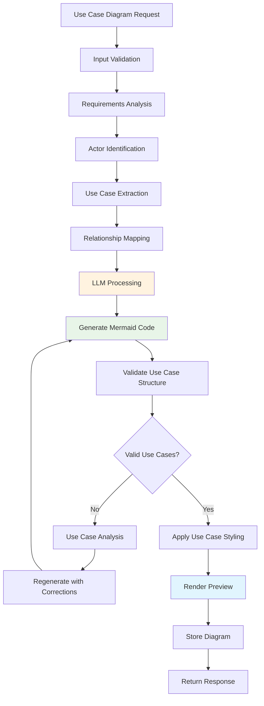

## Actor Classification Process

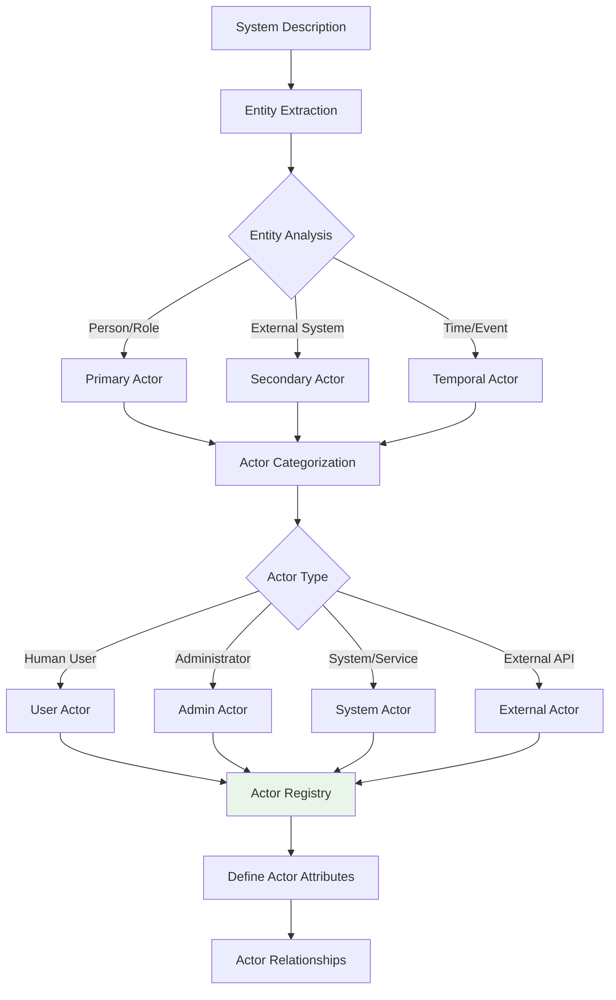

## Use Case Identification

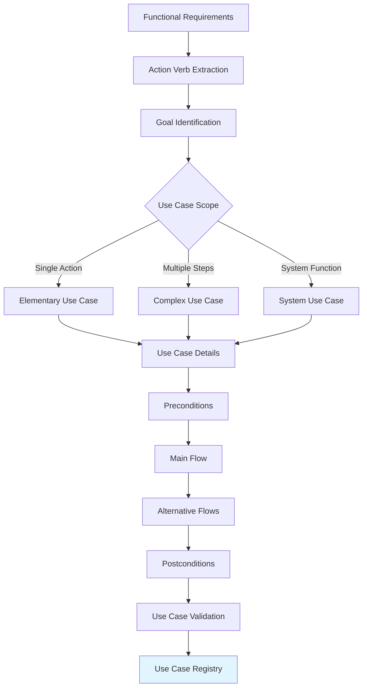

## Relationship Mapping

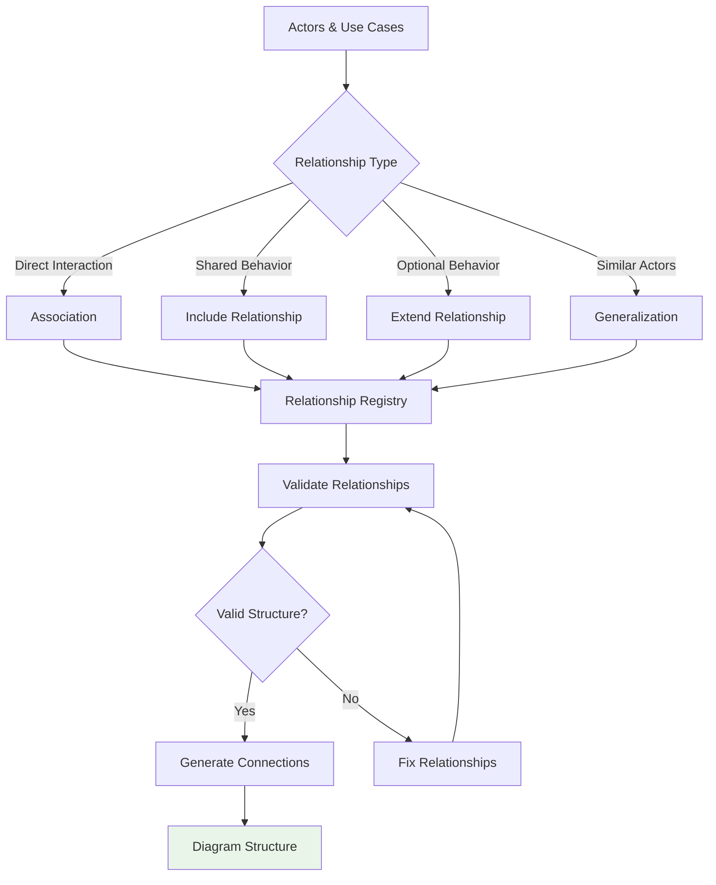

## Detailed Processing Flow

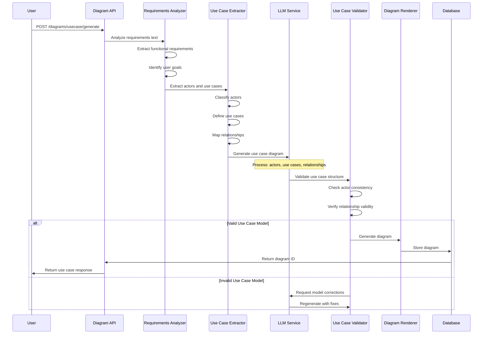

## Use Case Relationship Types

### Include Relationships

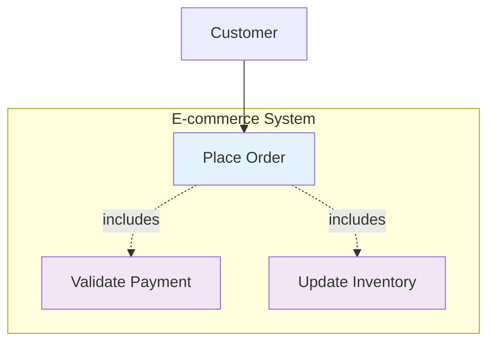

### Extend Relationships

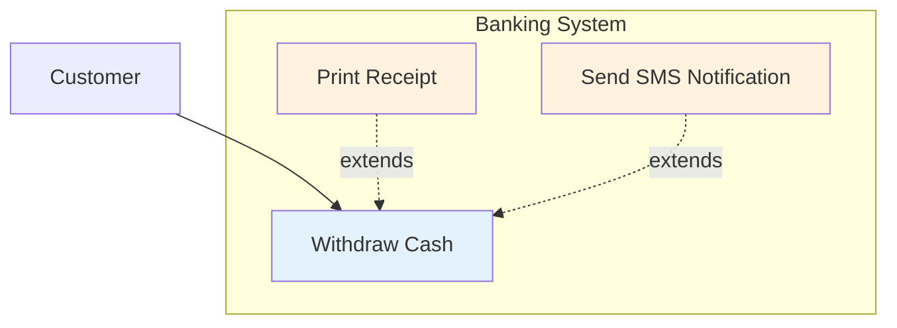

### Actor Generalization

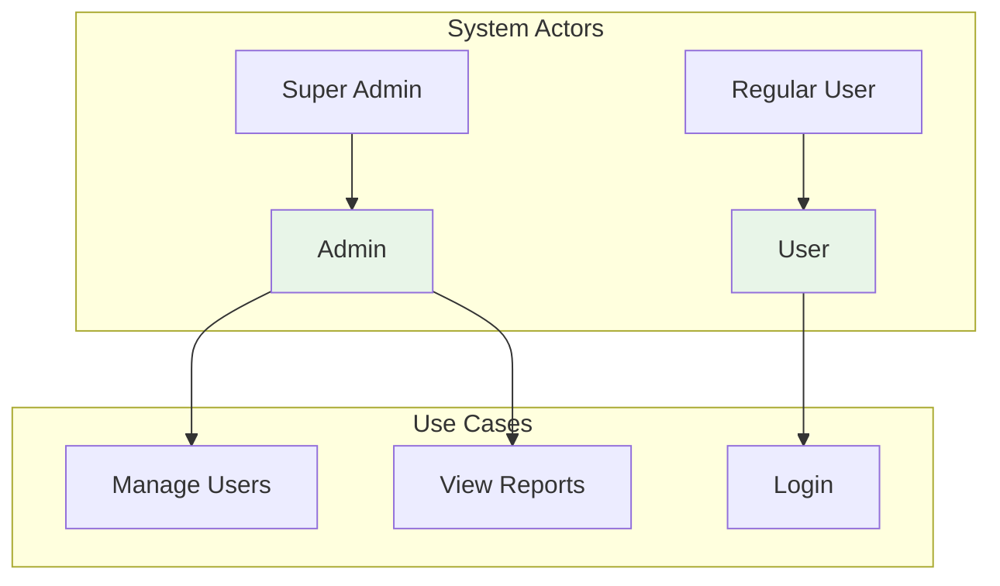

## Sample Input/Output

### Input Example

```json
{
  "title": "E-commerce Use Cases",
  "description": "E-commerce platform user interactions and admin functions",
  "actors": [
    {
      "name": "Customer",
      "type": "primary",
      "description": "End user purchasing products"
    },
    {
      "name": "Admin",
      "type": "primary",
      "description": "System administrator"
    }
  ],
  "use_cases": [
    {
      "name": "Browse Products",
      "actor": "Customer",
      "description": "Customer can browse product catalog"
    },
    {
      "name": "Manage Inventory",
      "actor": "Admin",
      "description": "Admin can manage product inventory"
    }
  ]
}
```

### Generated Mermaid Output

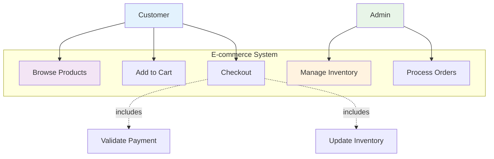

## Use Case Validation Rules

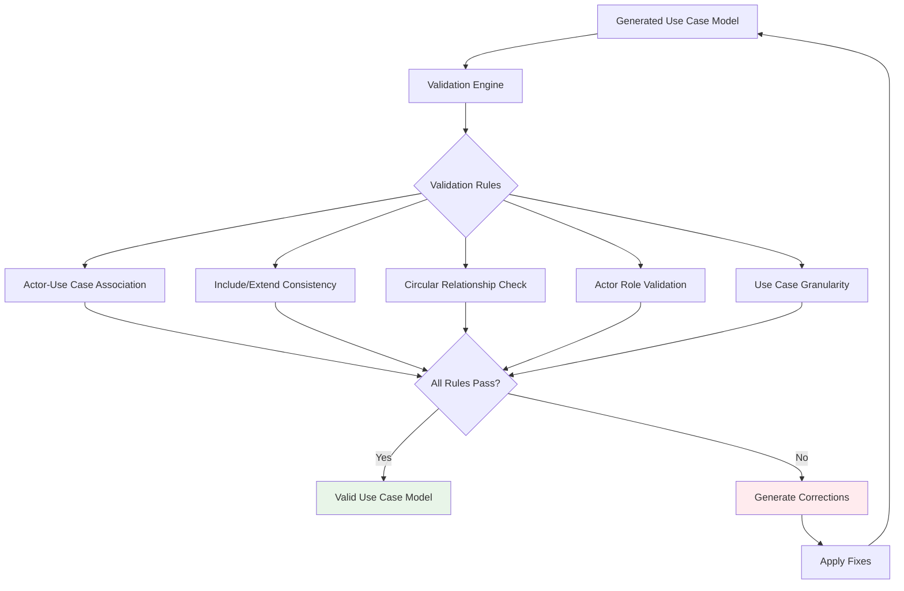

## Error Handling

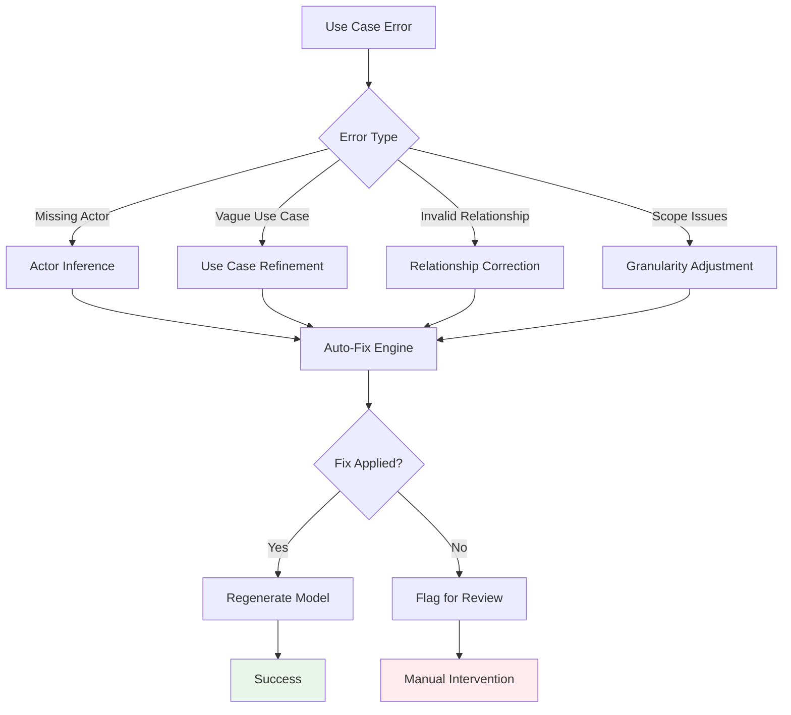

## Context-Aware Generation

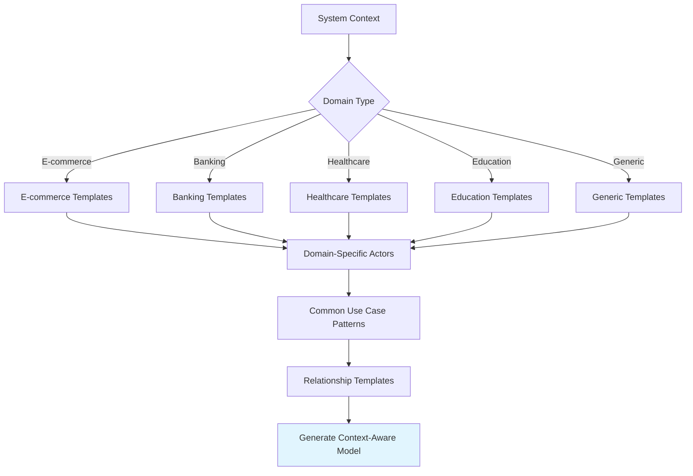

## Integration Points

### With SRS Generator

Use case diagrams are automatically generated for:

- Functional requirements sections
- User story collections
- System capability overviews
- Stakeholder interaction models

### With AI Conversation

Users can request use case diagrams through natural language:

- "Show me the use cases for an online banking system"
- "Generate use cases for customer management"
- "Create a use case diagram for our inventory system"

## Performance Considerations

- **Actor Limits**: Maximum 20 actors per diagram
- **Use Case Limits**: Maximum 40 use cases per diagram
- **Relationship Limits**: Maximum 100 relationships per diagram
- **Processing Time**: 20-60 seconds depending on complexity

## Quality Metrics

- **Actor Identification**: 91% accuracy for business domains
- **Use Case Extraction**: 87% accuracy for functional requirements
- **Relationship Mapping**: 83% accuracy for complex relationships
- **Model Completeness**: 89% coverage of functional requirements
