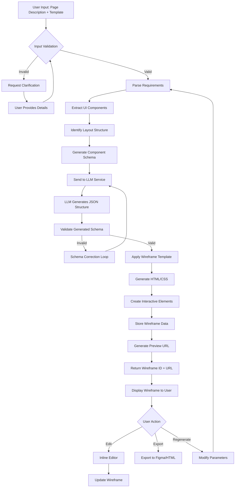
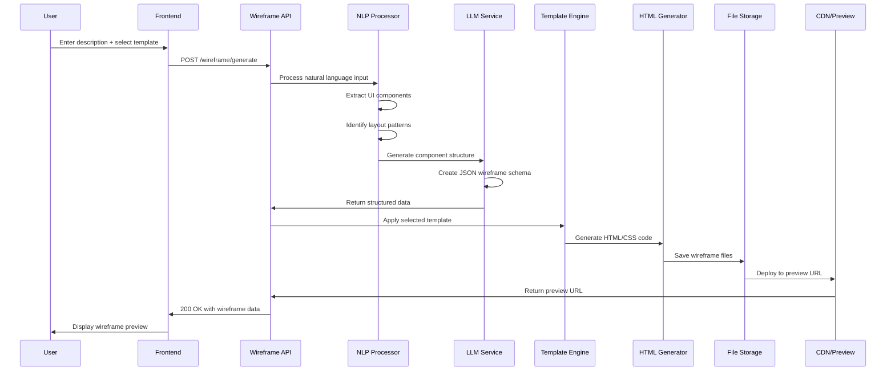
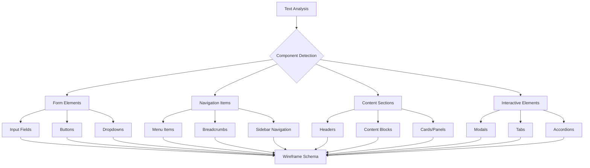
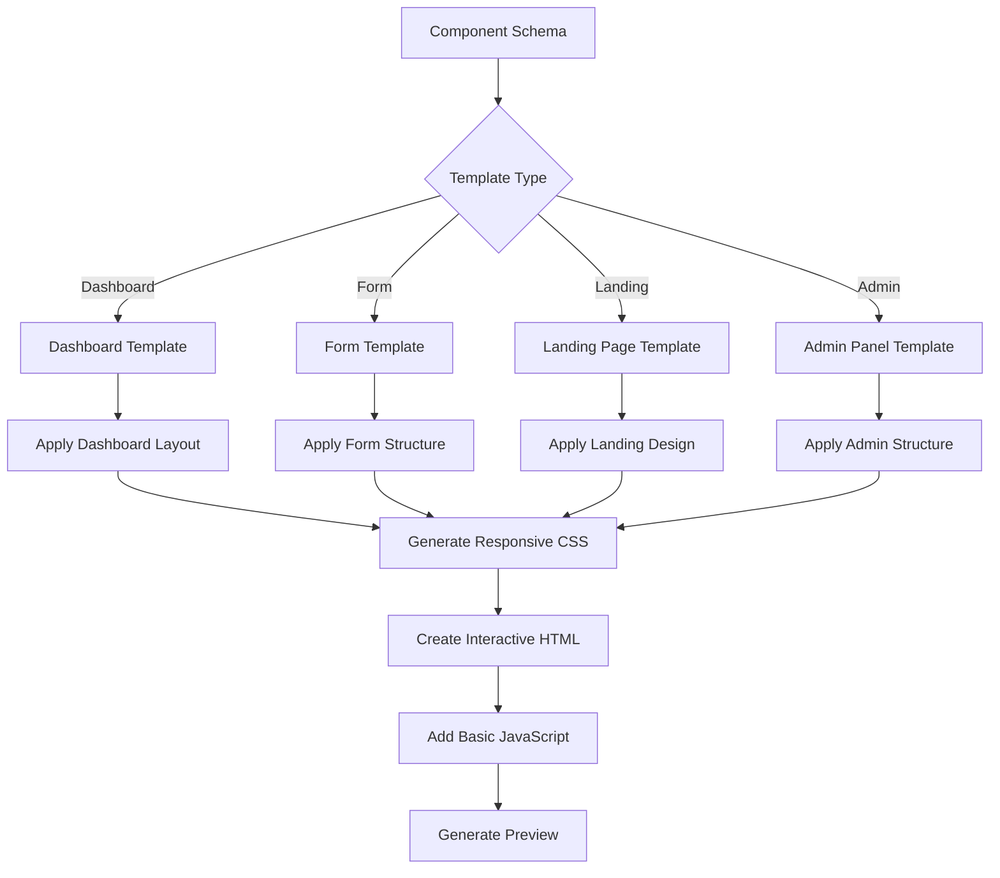
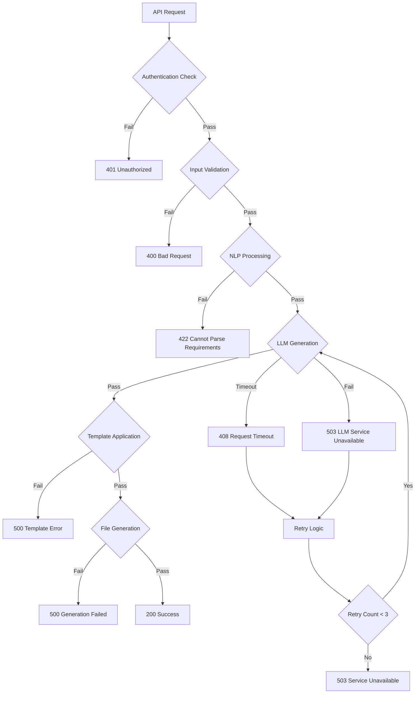

# Wireframe Generator Service Flow Diagram

## Overview

The Wireframe Generator service automatically creates wireframe prototypes from textual requirements and user descriptions.

## Primary Flow Diagram

## Technical Architecture Flow

## Component Recognition Flow

## Template Processing Flow

## Error Handling and Retry Logic

